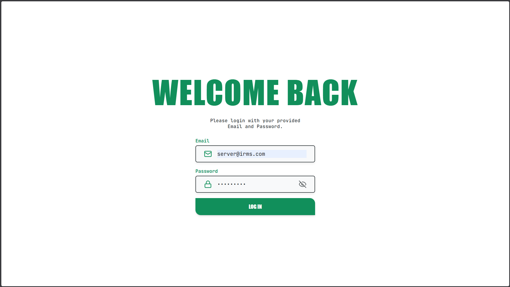
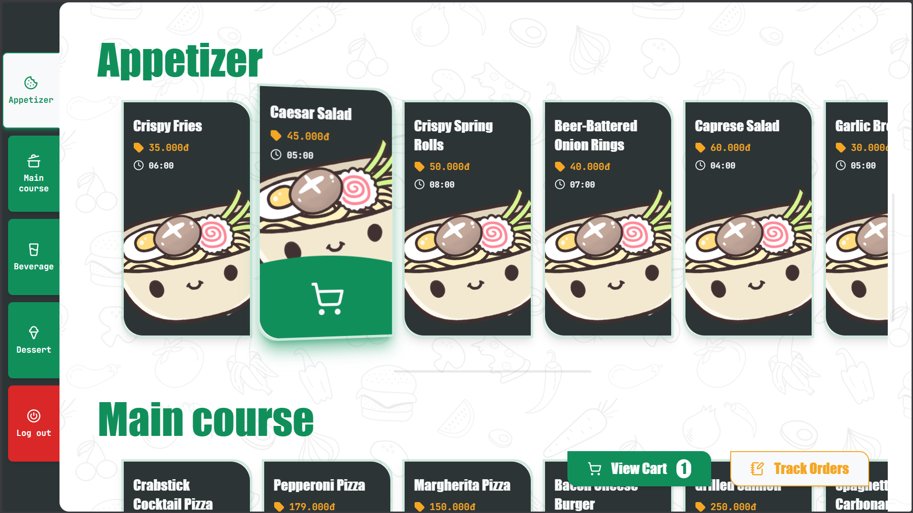
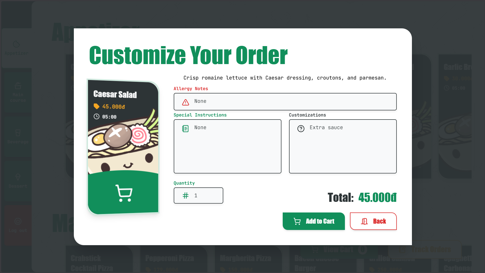
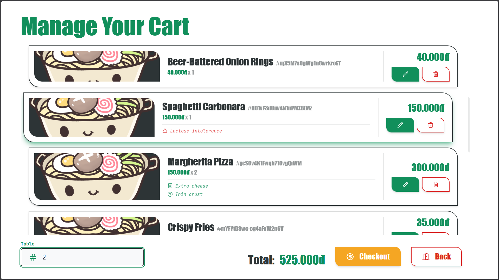
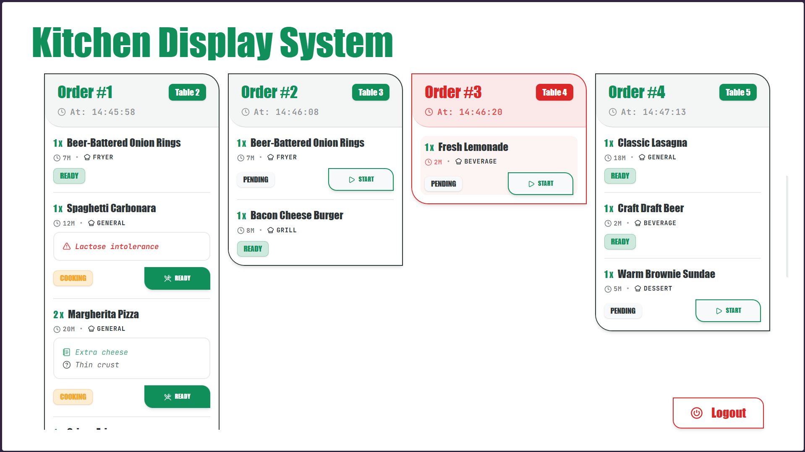
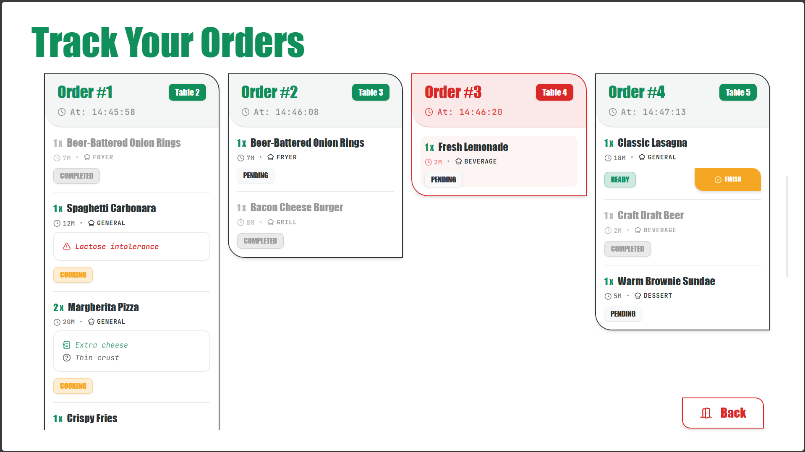

# IRMS Frontend 2.0

A React + TypeScript frontend for an interactive restaurant order management system. This application is built with Vite and designed to support menu browsing, cart checkout, authentication, and real-time kitchen display synchronization.

## Objectives

This project provides the frontend for an Order & Kitchen Display System (KDS) that supports:

- Menu browsing and item customization
- Cart and checkout flow
- User authentication
- Live kitchen updates via WebSocket/STOMP
- Background data synchronization for improved order consistency

## Key Features

- **Menu exploration**: display categories, item cards, and customization options.
- **Cart management**: add, update, and remove items with quantity controls.
- **Order customization**: choose item modifiers and review selections in a modal.
- **Authentication flow**: login management with protected routes.
- **Kitchen display synchronization**: real-time order updates using STOMP over WebSocket.
- **State management**: Redux Toolkit for application state and user/cart data.
- **Server caching and persistence**: React Query with storage persistence.
- **Animated UI interactions**: GSAP-powered animations for polished user experience.

## Technical Stack

- **Framework**: React 19
- **Language**: TypeScript
- **Build**: Vite
- **Styling**: Tailwind CSS
- **State management**: Redux Toolkit
- **Data fetching**: @tanstack/react-query
- **Routing**: React Router DOM
- **Realtime sync**: WebSocket + STOMP via react-stomp-hooks / stompjs
- **Animations**: GSAP
- **API client**: OpenAPI Fetch
- **Linting**: ESLint

## Project Structure

- `src/components` – shared UI components and layout wrappers
- `src/features/menu` – menu listing and menu item cards
- `src/features/cart` – cart page and cart item logic
- `src/features/kds` – kitchen display listener and card views
- `src/features/auth` – login page and auth hooks
- `src/api` – request clients, auth, menu, order, and KDS endpoints
- `src/store` – Redux store and slices
- `src/hooks` – reusable hooks and scroll spy utility
- `src/websocket` – real-time synchronization logic

## Getting Started

Install dependencies:

```bash
npm install
```

Run the development server:

```bash
npm run dev
```

Build for production:

```bash
npm run build
```

Verify TypeScript types:

```bash
npm run test:ts
```

Lint the code:

```bash
npm run lint
```

## Example UI

### Login Interface


### Menu Browsing


### Item Customization


### Cart Management & Checkout


### Kitchen Teams KDS


### Front-of-house Order Tracking



## Future Plan

- Add full order checkout and payment integration
- Add offline-first caching and sync recovery for intermittent network
- Enhance real-time communicaton between front-of-house and kitchen teams
- Expand analytics and dashboard reporting for order status
- Improve KDS filtering, sorting, and order prioritization
- Convert to a Progressive Web App (PWA) for installable use
- Add localization and accessibility improvements

## Notes

This repository is a frontend implementation for a restaurant management system. Backend endpoints and live data support are expected to be provided by a connected service.
